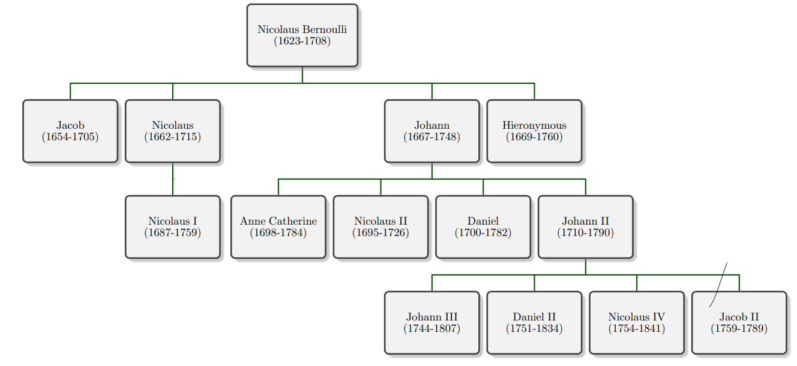

# Wykład 01: 02.03.22 - Matematyka na przełomie XVII i XVIII w., spojrzenie z dystansu

Tagi: [wiek XVII, Bernoulli

## Wstęp

W trakcie XVII rozpoczął się dynamiczny rozwój matematyki. Porównać go można z przełomem koperńikańskim. Trwa ośiwecenie. Rozwijają się:

- geometria analityczna (poziom "ponadlicealny")
- rachunek różniczkowy
- rachunek całkowy

## Ważne posataci i zasługi

- Isaac Newton: rachunek całkowy,
- Gottfried W. Leibniz,
- Michel Rolle: twierdzenie Rolle'a,
- Guillaume de l'Hospital: reguła de l'Hospitala,
- Abraham de Moivre: wzory de Moivre'a,
- Brook Taylor: szeregi Taylora,
- Christian Goldbach: hipoteza Goldbacha,
- James Stirling: wzór Stirlinga przybliżający silnię
- Gabriel Cramer: wzory Cramer'a do rozwiązywania równań liniowych

Pojawia się wiele uczelni inżynierskich oraz wojskowych.

## Co się dzieje i gdzie?

- Wielka Brytania
  - Następcy Wallisa i Newtona;
  - Uniwersytety Oxford, Cambridge, Edynburg, Glasgow;
  - Matematyka stosowana;
  - Zwalnia na koniec XVII w.;
  - Stirling, de Moivre, Taylor;

- Francja
  - Prężnie rozwija się w trakcie Oświecenia;
  - Akademia Francuska;
  - Uczniowie Kartezjusza;
  - Roll, de l'Hospital;
  - Zaskakująco dużo matematyków "z ludu". Wiedza stanowi drogę do pozycji społecznej;

- Niemcy
  - Po wojnie 30-letniej nic ciekawego się nie dzieje;
  - Trochę rachowania w Hamburgu, trochę astronomii w Norymberdze;

- Szwajcaria
  - Klan Bernoullich, Cramer;
  - Bazylea, Genewa;
  - Neutralność polityczna i światopoglądowa sprzyja rozwojowi nauki;

- Poza tym
  - W Skandynawii nic się nie dzieje;
  - We włoszech: uczniowie Galileusza w Padwie (ale nie dużo)

## Działy matematyki

- (Nowość!) Rachunek różniczkowy i całkowy;
  - Newton i Leibniz;
- Rachunek wariacyjny, rachunek prawdopodobieństwa, statystyka;
  - Bernoulli(todo: który), Newton, de Moivre; 
- Geometria analityczna;
- Algebra jest troszkę w tyle;
  - kłopoty z liczbami ujemnymi i abstrakcją;

## Klan Bernoullich

### Nicholaus Bernoulli (1623 - 1708)

Jego ojciec (Jakub Bernoulli) ciekł z Niderlandów do Bazylei w 1622. Nicholaus odziedziczył biznes handlowy po ojcu. Ożenił się z córką bankiera (12 dzieci). Był radnym w Bazylei.

### Hieronymous Bernoulli (1669-1760)

Odziedziczył biznes po Nicholausie.

### Nicholaus (zwany starszym) Bernoulli (1662 - 1715)

Malarz portretowy, radny Bazylei.

### Jacob Bernoulli (1654 - 1704)

Dzieła:

- Ars Conjectandi - Sztuka Przewidywania(wydane 1713);
  - Wartość oczekiwana;
  - Rozkład dwumianowy;
  - Prawo wielkich liczb;

Studiował w Bazylei języki, filozofię, teologię. Bazylea nie była jeszcze dobrym miejscem do studiowania nauk ścisłych.

Wyjechał po studiach do Genewy. Pracował jako prywatny nauczyciel. W końcu wylądował w Paryżu, gdzie poznał dzieła Kartezjusza. Potem Holandia, Anglia (Royal Society, Hook). Wtedy też zaczął publikować prace (teoria na temat powstawania komet, badanie masy eteru).

Wrócił do Bazylei, ożenił się i objął katedrę matematyki (podobno źle zarabiał).

- Bada wartość procentu składanego, szeregi nieskończone (suma odwrotności kwadratów liczb naturalnych jest znana jako problem Bazylejski);
- Jako pierwszy zauważył stałą *e*;
- Problem izochromy;
- Rachunek prawdopodobieństwa (rozkład Bernoulliego)
- Prawo wielkich liczb

### Johann Bernoulli (1667 - 1748)

Studiuje medycynę na uniwersytecie w Bazylei. Jedzie do Genewy i Paryża, gdzie wykłada swoją interpretację prac Leibniza. Spotyka de l'Hospitala, który zostaje jego (todo: słowo na filantropię w ośiweceniu). Wraca na jakiś czas do Bazylei, potem wyjeżdża na jakiś czas do Groningen.

Osiągnięcia:

- Problem krzywej łańcuchowej;
- Na podstawie jego wykładów de l'Hospital wydał pierwszy duży podręcznik do rachunku całkowego;
- Badał zagadnienie brachistochromy, zagadnienie izoperymetryczne;
- Podstawy hydrodynamiki

### Nicholaus I Bernouli (1687 - 1759)

Doktorat w Bazylei 

### Nicholaus II Bernouli (1695 - 1726)

### Ciekawostki

Pierrer Currie był potomkiem Bernoullich.
